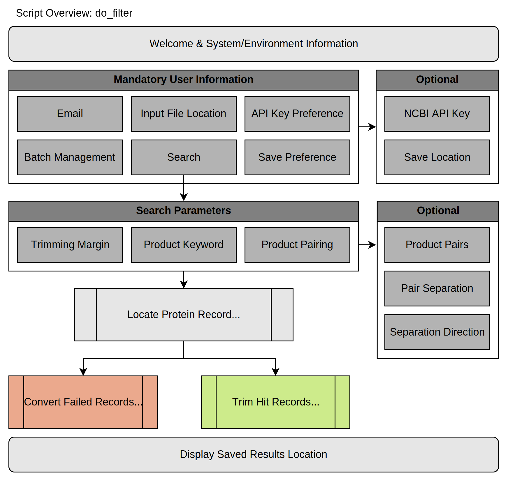

# MIE-2024
* Information about the piece, ex. accompanying paper and authors
* Beta version for the Parkinson Lab

## Purpose
MIE-2024 serves as a simple yet effective interface to automate non-ribosomal peptide synthetase (NRPS) and polyketide synthase (PKS) product prediction and synthesis planning. Intended for integration with NCBI BLAST-P service, users provide protein accessions to find, filter, and trim nucleotide records identified to encode possible products with desirable features. Genome annotation and product prediction is then carried out with antiSMASH, the results of which are transcribed into a synthesis friendly format.

## Required Third-Party Tools
The package relies on [antiSMASH](https://docs.antismash.secondarymetabolites.org/) for product prediction and [Biopython](https://biopython.org/) to interface with the NCBI Entrez API.

## Installation Components
- Python virtual environment
- Unix compatible operating system or environment
- antiSMASH local

## Installation Guide
Quick installation employs both Conda and Git. If you have not worked with these tools before, their documentation is linked below.
> Conda: <https://docs.conda.io/projects/conda/en/latest/> \
> Git: <https://git-scm.com/doc>

### Python Virtual Environment
We recommend creating a Conda environment with Python 3.12, using the following lines in a Conda initialized terminal:
```Bash
conda create -n MIE-2024 python=3.12
conda activate MIE-2024
```
With this environment activated, all non-antiSMASH dependencies can be installed with the following command:
```Bash
pip install git+https://github.com/Parkinson-NP/MIE-2024
```
Environments are created and populated with pip/Conda commands only once, then activated for later uses. If you have successfully activated your environment, your command prompt should begin with ```(environment_name)```. If you run into trouble with environment management, you can view your environments with ```conda env list``` and delete environments with ```conda env remove -n environment_name```.
### Unix Compatible OS or Environment
AntiSMASH 7.1 does not offer support for Windows OS. There are many options available to configure a Unix compatible environment on Windows OS. Native Unix users may proceed to installation of antiSMASH local.

 As an example, setup of Windows Subsystem Linux (WSL) is used here. For additional WSL tips and FAQs, official instructions are available at <https://learn.microsoft.com/en-us/windows/wsl/install>.

[//]: # (Give WSL instructions in detail??)  
[//]: # (Depending on your software version, you may need to enable WSL before moving forwards. WSL can be enabled via Administrator commands in Windows Powershell, or graphically in Windows Control Panel.)  
[//]: # (*Virtual Machine Platform* and *Windows Subsystem for Linux* must be enabled under **Windows Control Panel > Programs > Programs and Features > Turn Windows features on or off**. With the required features enabled, installation can be then be carried out graphically in the Microsoft Store, or with the following command in Windows Powershell:)
[//]: # (Bash wsl --install -d Ubuntu)  


If choosing to install your distribution from the Microsoft Store, please ensure you have set up a Linux account before proceeding. Your terminal prompt should show your device name and newly established Unix username:
 ```Bash
 USER@DEVICE:~$ 
 ```
This terminal prompt indicates you are sucessfully operating in a Unix environment, where you will not have direct access to  your Windows files or installations. To continue with Quick Installation, you'll need to configure Anaconda or Miniconda for your new Unix environment. Miniconda will provide the necessary packages for the least storage space, and can be installed as instructed in *Quick command line install* for Linux: <https://docs.anaconda.com/miniconda/>.

### AntiSMASH Local
In a Unix terminal as a non-root user, the following commands will be adequate to configure Bioconda and install antiSMASH in a new Conda environment.
```Bash
conda config --add channels bioconda
conda config --add channels conda-forge 
conda config --set channel_priority strict
conda create --platform "linux-64" -n antiSMASH antismash
```
```
conda activate antiSMASH
download-antismash-databases
conda deactivate
```
*antiSMASH* denotes the environment name (customizable), while *antismash* indicates the necessary package to Bioconda. antiSMASH is not installed in the same environment as MIE-2024 to allow use of other antiSMASH integrations with possible dependency clashes. Alternative installation methods are detailed in the [official antiSMASH guide](https://docs.antismash.secondarymetabolites.org/#how-to-use-antismash-local-installation).

# Use Instructions
## 1. Filtering BLAST-P Results
```do_filter``` utilizes Entrez to programatically access NCBI protein records and link to their corresponding nucleotide record. Each nucleotide record is surveyed for products of interest supplied by the user, which in combination with other parameters excludes nucleotide records and regions not associated with desirable product features from further processing. Records with no hits are not discarded, instead saved as JSON files for potential future analysis.



```do_filter``` is OS independent; it can be called from any terminal with your Conda environment activated.
```bash
conda activate MIE-2024
python3 -m MIE_2024.do_filter
```
Your system may replace ```python3``` with ```python``` or ```py```. Once initiated, you will be prompted to view an optional welcome message before continuing to enter mandatory and optional parameters. This message can also be used to confirm you are working in the intended environment.

For any user input, you will have the opportunity to affirm your choice and/or seek additional information about the parameter's requirements and usage. If at any point you supply an invalid input, you will be reprompted with additional detail. This information can also be called from the dictionary ```user_end.explanations``` on demand by typing ```--help```. Similarly, ```--end``` can be used to terminate the program at a decision point.

## 2. Product Prediction with antiSMASH
```do_prediction``` utilizes antiSMASH to predict and annotate the nucleotide regions isolated in ```do_filter```. ```do_prediction``` acts as a substitute for normal command line interface with antiSMASH, running many records consecutively with the same parameters.


In contrast to ```do_filter``` and ```do_synthesis```, product prediction requires a Unix terminal with the antiSMASH environment activated. To access ```do_prediction``` from its installation in your initial environment, you will first need to identify and navigate to its directory. 

```bash
conda activate antiSMASH
find /initial/path | grep "MIE_2024"
```
```bash
cd /full/path/returned/MIE_2024
```
For WSL users, this means searching your mounted drive, 
```/mnt/c```. Extending this initial path with more specificity, for example ```/mnt/c/users/username/anaconda3/envs``` can help reduce extraneous results.

With ```do_prediction``` now available in the antiSMASH environment, it can invoked similar to the OS-independent scripts. 
```bash
python3 do_prediction.py
```
```do_prediction``` relies only on the Python standard library, ensuring its dependencies are satisfied by those of antiSMASH. Other scripts may behave unexpectedly if run in the antiSMASH environment.

## 3. Product Synthesis Guide
```do_synthesis``` is a short organizational script used to parse the collection of nested files produced by antiSMASH into a CSV. Results are indexed and organized as series of monomers, aligned with the sequential procedure of solid-phase peptide synthesis. Product SMILES may be added for further detail.


```do_synthesis``` can be run identically to ```do_filter``` in the installation Conda environment, where information is available through the welcome message and ```user_end.explanations``` by typing ```--help```.
```bash
conda activate MIE-2024
python3 -m MIE_2024.do_synthesis
```
# License
To be determined.
# Support
Console information is saved as .log files in the subdirectory ```mie_2024_logs```, searchable by time of execution. Please utilize these logs in the event of unexpected program behavior to localize your issue to a particular script, dependency, or input case.

For related works and contact information, please visit [our website](https://www.parkinsonlaboratory.com/).
